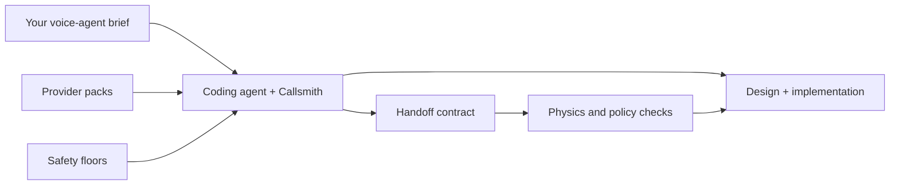

# Callsmith

Callsmith helps coding agents design voice systems that are safe to hand to an implementation team.
It supplies provider-specific audio facts, sensible safety defaults, and a small verification CLI so
the agent does not guess its way through telephony, streaming, barge-in, retention, or handoff.

[](https://skills.sh/Nachi-Kulkarni/Callsmith_skills)

## Install

One command installs the lean Callsmith skill in Codex, Claude Code, Cursor, OpenCode, and other
agents supported by the skills installer:

```bash
npx skills add https://github.com/Nachi-Kulkarni/Callsmith_skills/tree/main/skills/callsmith
```

Start a new agent session, then ask for `/callsmith` or simply describe the voice agent you want.
The skill-only download is about 270 KB and contains no benchmark runners, tests, credentials, or
local project files.

## What it gives your agent

- **Provider facts:** 21 checked packs covering audio formats, streaming behavior, interruption,
  deployment constraints, environment keys, and known potholes.
- **Safety floors:** clear minimum choices for recording consent, transcript retention, human
  handoff, and tool failure.
- **A handoff contract:** one reviewable file that records the stack, audio path, ownership, safety
  choices, and a quantified latency or cost tradeoff.
- **Checks:** optional commands that catch unknown providers, impossible audio paths, incomplete
  contracts, and contradictions between prose and machine-readable decisions.

Callsmith does not generate a framework scaffold or host calls. The coding agent still chooses the
architecture and writes the application using LiveKit, Pipecat, or the target project's own stack.



## Five-minute example

Suppose a clinic phone-agent draft says consent matters, but its actual choices still contain no
recording notice, seven-day retention, ticket-only escalation, and an assumed audio bridge:

```json
{
  "surface": "inbound_pstn",
  "recording_consent": "none",
  "transcript_retention": "seven_days",
  "human_handoff": "ticket"
}
```

With Callsmith, the agent loads only the relevant packs, makes the audio ownership explicit, and
rewrites the machine choices to meet the project's conservative medical defaults:

```json
{
  "domain": "medical",
  "recording_consent": "announce",
  "transcript_retention": "thirty_days",
  "human_handoff": "transfer",
  "turn_gap_p95_target_ms": 900
}
```

See the complete [clinic example](./examples/clinic-triage/) and its structured receipt. If you also
want the verification CLI, install the repository package and run the real files:

```bash
npm install -g github:Nachi-Kulkarni/Callsmith_skills
callsmith check --answers examples/clinic-triage/voice.answers.json
callsmith contract validate --file examples/clinic-triage/callsmith.recipe.md \
  --answers examples/clinic-triage/voice.answers.json --domain medical
```

## What the current evidence says

CallsmithBench gives the same coding model the same brief twice: once normally and once with
Callsmith. It then checks the completed design files, not promises in the model's response.

In the latest Luna/xhigh diagnostic, the 32 complete pairs produced:

| Handoff check | Without Callsmith | With Callsmith |
|---|---:|---:|
| Individual checks passed | 26/128 | 128/128 |
| Safe consent, retention, and handoff | 14/32 | 32/32 |
| Compatible providers and audio path | 0/32 | 32/32 |
| Complete handoff file | 0/32 | 32/32 |
| No hard contradictions | 12/32 | 32/32 |

The low unassisted totals do not mean those drafts were useless or that voice agents cannot be built
without Callsmith. Many were plausible. The benchmark asks a narrower question: were all four
handoff requirements explicit and mutually consistent without another engineer repairing the
artifact first?

This is a single-model-family design diagnostic. It does **not** prove deployed call quality,
latency, uptime, cost, or real-user success. No provider latency number is published yet. Read the
[plain-language diagnostic](./evidence/diagnostics/luna-xhigh-full-suite-20260731.md),
[evidence rules](./evidence/README.md), and [Honest Numbers](./evidence/HONEST-NUMBERS.md).

## Use Callsmith when

- a coding agent is designing or implementing a phone, browser, or voice-note workflow;
- provider audio formats and interruption ownership need to be reviewable;
- regulated or high-stakes flows need explicit consent, retention, and escalation decisions;
- another engineer must inherit the work from committed artifacts instead of chat history.

Use something else when you want a hosted voice runtime, a drag-and-drop bot builder, legal
certification, or a framework scaffold. Callsmith's floors are conservative product defaults, not
legal advice.

## Playbooks

| Command | Outcome |
|---|---|
| `/callsmith` | Brief → provider-backed decisions → contract → implementation |
| `/callsmith audit` | Readiness score and concrete gaps; no edits |
| `/callsmith critique` | An opinionated stack review with one recommendation |
| `/callsmith architecture` | Decide S2S, cascaded, or hybrid from the constraints |
| `/callsmith latency` | Trace user speech-end to first audible response |
| `/callsmith ttft` | Isolate the LLM first-token leg |
| `/callsmith prompts` | Write or review the production runtime prompt |
| `/callsmith harden` | Check resilience, state, tools, and safety before a pilot |
| `/callsmith deploy` | Plan ownership, regions, drain, warmup, and scaling evidence |

## Optional verification CLI

```bash
callsmith packs
callsmith pack show twilio
callsmith pack validate
callsmith verify-packs
callsmith check --answers voice.answers.json
callsmith contract validate --file callsmith.recipe.md --answers voice.answers.json
callsmith doctor
```

The CLI verifies facts and contracts. Removed generation commands such as `init`, `forge`,
`scaffold`, and `simulate` deliberately fail instead of pretending a generated skeleton is
production proof.

## Install, update, remove, or roll back

The universal installer is the primary path. It selects the agents installed on your machine and
supports interactive or global installation. Node 22 is recommended for the current upstream
installer; the optional Callsmith CLI itself supports Node 18 and newer.

```bash
# install globally for your detected agents
npx skills add https://github.com/Nachi-Kulkarni/Callsmith_skills/tree/main/skills/callsmith -g

# update installed skills
npx skills update

# remove Callsmith
npx skills remove callsmith

# install an immutable release instead of main
npx skills add https://github.com/Nachi-Kulkarni/Callsmith_skills/tree/v1.8.0-agent-compiler/skills/callsmith
```

| Path | What is verified here |
|---|---|
| Universal skill directory | Copied installation into Codex with Node 22; self-contained file parity tested |
| Packed npm CLI | Fresh tarball install plus `doctor`, example `check`, and contract validation tested |
| Native client manifests | Structure tested; retained for clients that prefer their own plugin manager |

The installer and its supported-agent list are maintained by the
[Vercel skills CLI](https://www.skills.sh/docs/cli). Native manifests remain in this repository for
Codex, Claude Code, Cursor, OpenCode, Pi, Kimi, Devin, Grok, and Antigravity, but manifest presence
is not presented as a successful runtime test in every client.

## Provider coverage

Telephony: Exotel, Twilio, Plivo, Telnyx, Vonage. Orchestration: LiveKit, Pipecat, custom FastAPI.
Realtime: Gemini Live and OpenAI Realtime. Speech and model packs include Deepgram, AssemblyAI,
OpenAI, Anthropic, Google, ElevenLabs, Cartesia, Sarvam, Silero, and WebRTC VAD.

Unknown providers are not invented. Add a dated, sourced JSON pack under `providers/` and run
`callsmith pack validate`.

## Maintenance and security

- [Product decisions](./product_decisions.md) — the product constitution
- [Skill procedure](./SKILL.md) — the agent's compile loop
- [Contract schema](./reference/contract.md) and [policy vocabulary](./reference/policy.md)
- [Current-documentation policy](./reference/current-docs.md)
- [Changelog](./CHANGELOG.md), [contributing](./CONTRIBUTING.md),
  [security](./SECURITY.md), and [maintenance](./MAINTENANCE.md)
- [Release process](./docs/RELEASING.md)

Provider APIs change. Packs keep dated sources and expiry checks; implementation work must re-open
official documentation for version-sensitive facts. Security reports belong in a private GitHub
advisory, never a public issue.

## License

MIT
