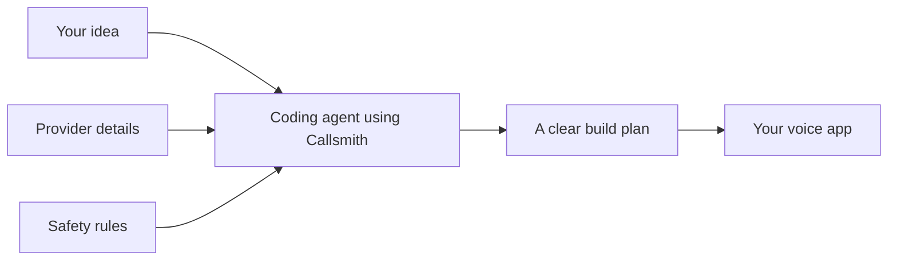

# Callsmith

Give your coding agent a voice-app brief. Callsmith helps it choose a workable stack, make the
important safety decisions, and write a build plan that another engineer can follow.

[](https://skills.sh/Nachi-Kulkarni/Callsmith_skills)
[](https://github.com/Nachi-Kulkarni/Callsmith_skills/actions/workflows/ci.yml)

## Install

```bash
npx skills add https://github.com/Nachi-Kulkarni/Callsmith_skills/tree/main/skills/callsmith
```

Start a new agent session, then ask it to use `/callsmith` or simply describe the voice app you want
to build.

The skill works with Codex, Claude Code, Cursor, OpenCode, and other agents supported by the
[skills installer](https://www.skills.sh/docs/cli). The download is about 270 KB and contains no
credentials, benchmark runners, or local project files.

## What Callsmith does

Voice apps have a lot of small details that are easy to miss. Audio formats need to match. Someone
must own interruptions. Recording needs a clear consent rule. Transfers and failed tools need a
safe fallback.

Callsmith gives your coding agent checked details for 21 voice providers and a simple process for
turning your brief into a build plan. It helps the agent:

- choose providers that can work together;
- spell out consent, data retention, and human handoff choices;
- describe the audio path and who owns each part;
- catch missing details and conflicting decisions before implementation.

Your agent still writes the application. Callsmith does not host calls, generate a framework
project, or replace tools such as LiveKit and Pipecat.



## A quick example

A clinic assistant may say that recording consent matters while leaving unsafe choices in its
configuration:

```json
{
  "surface": "inbound_pstn",
  "recording_consent": "none",
  "transcript_retention": "seven_days",
  "human_handoff": "ticket"
}
```

Callsmith makes those choices explicit and applies the project's safer medical defaults:

```json
{
  "domain": "medical",
  "recording_consent": "announce",
  "transcript_retention": "thirty_days",
  "human_handoff": "transfer",
  "turn_gap_p95_target_ms": 900
}
```

The full [clinic example](./examples/clinic-triage/) includes the build plan and the matching
machine-readable choices.

If you want to check those files yourself, install the optional CLI:

```bash
npm install -g github:Nachi-Kulkarni/Callsmith_skills
callsmith check --answers examples/clinic-triage/voice.answers.json
callsmith contract validate --file examples/clinic-triage/callsmith.recipe.md \
  --answers examples/clinic-triage/voice.answers.json --domain medical
```

## What we have tested

Current models design voice agents well. Callsmith makes their designs verifiable.

Diagnostic numbers from live paired CSB runs (2026-08-15, harness prompt revision 2 +
published interface): the same agent, same brief, same budget — once working normally,
once with the Callsmith skill. Both arms receive the identical output interface
(canonical enums, receipt schema); the skill is the only difference. Scores are
deterministic gates on the artifacts, never a judge.

**10–11 briefs per model · deterministic gates · paired arms** — single run per
scenario (diagnostic grade; 3-repetition runs with tightened intervals come before any
product claim). OpenCode runs are diagnostic-grade isolation; Codex runs are
publication-eligible. This measures design artifacts, not call quality, latency,
uptime, or deployed cost.

| | Normal | + Callsmith | lift |
|---|---:|---:|---:|
| DeepSeek V4 Flash — fully gated designs | 7/10 | 9/9* | **+30pp** |
| GPT-5.6-Luna xhigh — fully gated designs | 6/11 | 11/11 | **+45pp** |

Per-gate (both models, normal arm): reality traps 100%, stack physics 100% — the
models are good. The lift lives entirely in **safety-floor completion** and
**machine-validatable contract consistency**, the two things the skill enforces.
The frontier model gained *more* than the cheap one: strong reasoning writes
confident designs, and nothing without a verifier makes it re-check them.

\* one WITH arm was invalidated by the actor omitting its recipe file (correctly
caught by validity gates), not by the skill.

Read the [run report](./evidence/diagnostics/csb-fair-harness-20260815.md),
[test rules](./evidence/README.md), and [full limitations](./evidence/HONEST-NUMBERS.md).
Earlier (2026-07) diagnostic numbers published in this README were withdrawn —
see the note atop the old report.

## Things you can ask Callsmith to do

| Command | What it does |
|---|---|
| `/callsmith` | Turns a voice-app brief into clear technical decisions and a build plan |
| `/callsmith audit` | Shows what is missing without changing your files |
| `/callsmith critique` | Reviews your stack and recommends one direction |
| `/callsmith architecture` | Helps choose speech-to-speech, cascaded, or hybrid |
| `/callsmith latency` | Plans how to measure the delay after a user stops speaking |
| `/callsmith ttft` | Isolates the language model's first-token delay |
| `/callsmith prompts` | Writes or reviews the runtime prompt |
| `/callsmith harden` | Checks failures, state, tools, and safety before a pilot |
| `/callsmith deploy` | Plans regions, warmup, scaling, and safe shutdowns |
| `/callsmith noise-cancellation` | Designs and validates open-source echo, noise, and side-speaker suppression |
| `/callsmith security` | Keeps card numbers, personal data, and caller-driven tool abuse out of transcripts and logs |
| `/callsmith multilingual` | Plans mixed-language callers, voices, and per-language quality checks |

## Optional CLI checks

```bash
callsmith packs
callsmith pack show twilio
callsmith pack validate
callsmith verify-packs
callsmith check --answers voice.answers.json
callsmith contract validate --file callsmith.recipe.md --answers voice.answers.json
callsmith doctor
```

The CLI checks provider data and build plans. It does not generate an app. Older generation commands
such as `init`, `forge`, `scaffold`, and `simulate` have been removed.

## Update, remove, or pin a version

```bash
# install for every supported agent found on this machine
npx skills add https://github.com/Nachi-Kulkarni/Callsmith_skills/tree/main/skills/callsmith -g

# update installed skills
npx skills update

# remove Callsmith
npx skills remove callsmith

# install this exact release
npx skills add https://github.com/Nachi-Kulkarni/Callsmith_skills/tree/v1.8.0-agent-compiler/skills/callsmith
```

Node 22 is recommended for the skills installer. The optional Callsmith CLI supports Node 18 and
newer.

We tested a copied skills.sh installation in Codex and a clean install of the packed npm CLI. The
repository also includes native manifests for Claude Code, Cursor, OpenCode, Pi, Kimi, Devin, Grok,
and Antigravity. Those manifests are checked for structure, but we do not claim a full runtime test
in every client.

## Supported providers

- Phone providers: Exotel, Twilio, Plivo, Telnyx, and Vonage
- App frameworks: LiveKit, Pipecat, and custom FastAPI
- Realtime models: Gemini Live and OpenAI Realtime
- Speech and language providers: Deepgram, AssemblyAI, OpenAI, Anthropic, Google, ElevenLabs,
  Cartesia, and Sarvam
- Voice activity detection: Silero, WebRTC VAD, and Deepgram endpointing

Callsmith never makes up details for an unknown provider. New provider information must be added as
a dated, sourced JSON file under `providers/` and pass `callsmith pack validate`.

## Limits

Callsmith is not a hosted voice platform, a legal certification, or a drag-and-drop bot builder. Its
safety rules are conservative product defaults, not legal advice. Provider APIs also change, so
production work should check current official documentation before shipping.

## Project links

- [How Callsmith makes product decisions](./product_decisions.md)
- [How the skill works](./SKILL.md)
- [Build-plan format](./reference/contract.md)
- [Safety rules](./reference/policy.md)
- [Changelog](./CHANGELOG.md)
- [Contributing](./CONTRIBUTING.md)
- [Security policy](./SECURITY.md)
- [Release process](./docs/RELEASING.md)

Security reports should use a private GitHub advisory, not a public issue.

## License

MIT
